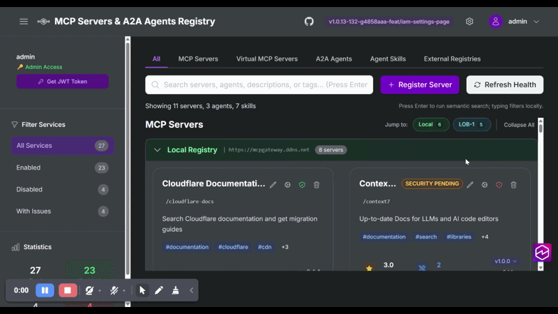

# IAM Settings UI

This document describes the Identity and Access Management (IAM) Settings UI, which provides a visual interface for managing users, groups, and machine-to-machine (M2M) service accounts directly from the MCP Gateway Registry web interface.

## Overview

The IAM Settings UI is accessible to administrators via **Settings > IAM** in the left navigation panel. It provides three management sections:

- **Groups** - Create and manage access control groups with fine-grained permissions
- **Users** - Create and manage human user accounts
- **M2M Accounts** - Create and manage machine-to-machine service accounts for AI agents and automation

The IAM UI works with both Keycloak and Microsoft Entra ID identity providers, providing a unified experience regardless of which IdP you use.



## Prerequisites

- Administrator access to the MCP Gateway Registry
- A configured identity provider (Keycloak or Entra ID)
- For Entra ID: Application configured with User.ReadWrite.All and GroupMember.ReadWrite.All permissions

## Groups Management

Groups are the primary unit of access control. Each group maps to an IdP group and defines what servers, tools, agents, and UI features members can access.

### Creating a Group

1. Navigate to **Settings > IAM > Groups**
2. Click the **Create Group** button
3. Fill in the required fields:
   - **Name**: Group identifier (will be created in the IdP)
   - **Description**: Human-readable description of the group's purpose

### Configuring Server Access

Server access defines which MCP servers and virtual servers the group can connect to via the MCP Gateway.

1. In the **Server Access** section, click **Add Server**
2. Select a server from the dropdown (includes both MCP servers and virtual servers)
3. Configure access:
   - **Methods**: Select which MCP methods are allowed (initialize, tools/list, tools/call, etc.)
   - **Tools**: Select specific tools or use `*` for all tools on that server

**Tip**: Virtual servers (paths starting with `/virtual/`) are automatically displayed alongside regular MCP servers in the server selector.

### Configuring UI Permissions

UI permissions control what users can see and do in the Registry web interface:

| Permission | Description |
|------------|-------------|
| `list_service` | View MCP servers in the dashboard |
| `register_service` | Register new MCP servers |
| `health_check_service` | Trigger health checks on servers |
| `toggle_service` | Enable/disable servers |
| `modify_service` | Edit server configuration |
| `delete_service` | Delete servers |
| `list_agents` | View A2A agents in the dashboard |
| `get_agent` | View agent details |
| `publish_agent` | Register new agents |
| `modify_agent` | Edit agent configuration |
| `delete_agent` | Delete agents |
| `list_virtual_server` | View virtual MCP servers |

For each permission, specify which resources it applies to:
- Use `all` to grant access to all resources
- Use specific server/agent paths for fine-grained control

### Configuring Agent Access

Agent access controls which A2A agents the group can interact with:

1. In the **Agent Access** section, click **Add Agent**
2. Select an agent from the dropdown
3. Select allowed actions (list_agents, get_agent, invoke_agent, etc.)

### Import/Export Scope JSON

Groups can be imported and exported as JSON for version control, backup, or migration:

**Export**: Click the download icon to export the current group configuration as JSON

**Import**: Click the upload icon and paste a scope JSON configuration:

```json
{
  "scope_name": "data-team",
  "description": "Data team with access to data processing tools",
  "server_access": [
    {
      "server": "data-processor",
      "methods": ["initialize", "tools/list", "tools/call"],
      "tools": ["process_csv", "analyze_data"]
    }
  ],
  "group_mappings": ["data-team"],
  "ui_permissions": {
    "list_service": ["data-processor"],
    "health_check_service": ["data-processor"]
  },
  "create_in_idp": true
}
```

## Users Management

The Users section manages human user accounts that can log into the Registry UI and generate JWT tokens for CLI tools.

### Creating a User

1. Navigate to **Settings > IAM > Users**
2. Click **Create User**
3. Fill in the required fields:
   - **Username**: Unique identifier for the user
   - **Email**: User's email address
   - **First Name**: User's first name
   - **Last Name**: User's last name
   - **Password**: Initial password (user should change on first login)
4. Select groups to assign the user to
5. Click **Create**

### Managing User Groups

To modify a user's group memberships:

1. Find the user in the list
2. Click the edit (pencil) icon in the Groups column
3. Check/uncheck groups as needed
4. Click the checkmark to save

### Deleting a User

1. Find the user in the list
2. Click the delete (trash) icon
3. Confirm the deletion

**Note**: Deleting a user removes them from the IdP. This action cannot be undone.

## M2M Accounts (Service Accounts)

M2M (Machine-to-Machine) accounts are service accounts for AI agents, automation scripts, and other non-human clients that need to authenticate with the Registry API.

### Creating an M2M Account

1. Navigate to **Settings > IAM > M2M Accounts**
2. Click **Create M2M Account**
3. Fill in the required fields:
   - **Name**: Identifier for the service account (e.g., `my-ai-agent`)
   - **Description**: Purpose of the service account
4. Select groups to assign (determines what the account can access)
5. Click **Create**

### Viewing Credentials

After creating an M2M account, the client credentials are displayed **once**:

- **Client ID**: The OAuth2 client identifier
- **Client Secret**: The OAuth2 client secret

**Important**: Copy and store these credentials securely. The client secret cannot be retrieved again after you navigate away.

### Using M2M Credentials

To obtain a JWT token for API access:

```bash
# Get JWT token using client credentials grant
# For local testing, use http://localhost for Keycloak
TOKEN=$(curl -s -X POST "https://keycloak.example.com/realms/mcp-gateway/protocol/openid-connect/token" \
  -H "Content-Type: application/x-www-form-urlencoded" \
  -d "client_id=my-ai-agent" \
  -d "client_secret=YOUR_CLIENT_SECRET" \
  -d "grant_type=client_credentials" | jq -r '.access_token')

# Use the token to call Registry API
# For local testing, use http://localhost
curl -H "Authorization: Bearer $TOKEN" "https://registry.example.com/api/servers"
```

Or use the provided helper script:

```bash
# Create credentials file
mkdir -p .oauth-tokens
cat > .oauth-tokens/my-ai-agent.json << EOF
{
  "client_id": "my-ai-agent",
  "client_secret": "YOUR_CLIENT_SECRET"
}
EOF

# Get token (uses KEYCLOAK_URL env var, defaults to http://localhost)
./scripts/refresh_m2m_token.sh my-ai-agent

# Use the token
# For local testing, use http://localhost
export TOKEN=$(jq -r '.access_token' .oauth-tokens/my-ai-agent-token.json)
curl -H "Authorization: Bearer $TOKEN" "https://registry.example.com/api/servers"
```

### Deleting an M2M Account

1. Find the account in the list
2. Click the delete (trash) icon
3. Confirm the deletion

**Note**: Deleting an M2M account immediately invalidates all tokens issued to it.

## Best Practices

### Group Organization

- Create groups based on team function or access level (e.g., `data-team`, `ml-engineers`, `read-only-users`)
- Use descriptive names and descriptions
- Apply the principle of least privilege - grant only the access needed

### Server Access

- Start with minimal methods and tools, expand as needed
- Use tool-level restrictions rather than granting `*` when possible
- For virtual servers, ensure `list_virtual_server` UI permission is granted

### M2M Accounts

- Create separate M2M accounts for each service or agent
- Rotate credentials periodically
- Store secrets in a secure vault, not in code repositories
- Use descriptive names that identify the service (e.g., `data-pipeline-bot`, `monitoring-agent`)

## Troubleshooting

### User Cannot See Servers

1. Check the user's group membership
2. Verify the group has `list_service` UI permission for the server
3. For virtual servers, verify `list_virtual_server` UI permission

### User Cannot See Virtual Servers

Virtual servers require the `list_virtual_server` UI permission. Add this permission to the group:

```json
{
  "ui_permissions": {
    "list_virtual_server": ["/virtual/your-server-path"]
  }
}
```

### M2M Account Token Not Working

1. Verify the client credentials are correct
2. Check that the M2M account is assigned to appropriate groups
3. Ensure the groups have the necessary `server_access` permissions
4. Check Keycloak/Entra ID logs for authentication errors

### Group Changes Not Taking Effect

After modifying group permissions:
1. Users may need to log out and log back in
2. M2M accounts need to obtain a new token
3. Changes to IdP group membership may take a few minutes to sync

## Related Documentation

- [Scopes Management](scopes-mgmt.md) - Detailed scope configuration format
- [Authentication Design](design/authentication-design.md) - Architecture overview
- [IdP Provider Architecture](design/idp-provider-support.md) - Multi-provider support details
- [Keycloak Integration](keycloak-integration.md) - Keycloak setup guide
- [Entra ID Setup](entra-id-setup.md) - Microsoft Entra ID configuration
