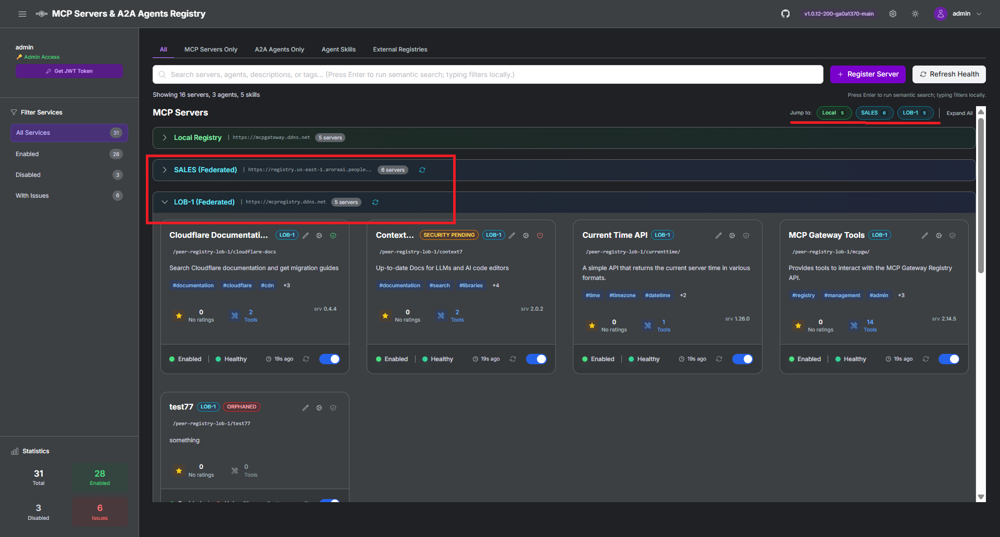
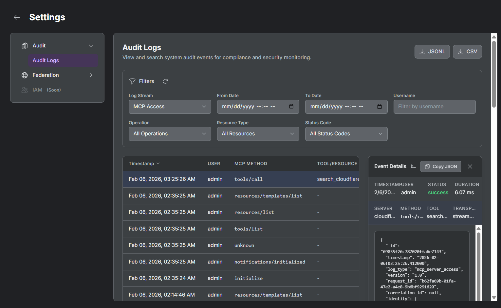

# Release v1.0.13 - Federated Registry, Agent Skills & Audit Logging

**February 2026**

---

## Major Features

### Federated Registry



Connect multiple MCP Gateway registries together with bi-directional synchronization:

- **Peer Registry Management**: Add, configure, and manage peer registries through the UI or CLI
- **Automatic Sync**: Servers and agents sync between registries with configurable filters (whitelist, tag-based)
- **Chain Prevention**: Prevents A->B->C sync loops for clean federation topology
- **Orphan Detection**: Identifies and manages orphaned items when peer registries are removed
- **Security Scan Sync**: Security scan results propagate across federated registries
- **Visibility Control**: Configure which servers/agents are exported to peers (public, internal, private)

[PR #422](https://github.com/agentic-community/mcp-gateway-registry/pull/422) | [Federation Guide](docs/federation.md)

### Agent Skills Registry

Register, discover, and manage agent skills with health monitoring and ratings:

- **Skill Registration**: Register individual agent skills with metadata and SKILL.md documentation
- **Health Checks**: Automatic health monitoring for registered skills
- **Skill Ratings**: Community-driven 5-star rating system for skills
- **Semantic Search**: Skills are indexed for semantic search alongside servers and agents
- **UI Integration**: Browse, rate, and view skill documentation from the registry UI

[PR #451](https://github.com/agentic-community/mcp-gateway-registry/pull/451) | Multiple skill-related commits

### Audit Logging & Compliance



Comprehensive audit logging for API and MCP access tracking:

- **MongoDB Storage**: All audit events stored in MongoDB for scalability
- **API & MCP Logging**: Track both REST API calls and MCP tool invocations
- **Admin UI**: View, filter, and sort audit logs from the Settings menu
- **Compliance Ready**: Designed for enterprise compliance requirements

[PR #449](https://github.com/agentic-community/mcp-gateway-registry/pull/449)

### MCP Server Version Routing

Route requests to specific server versions using HTTP headers:

- **Header-Based Routing**: Use `X-MCP-Server-Version` header to target specific versions
- **Version Management**: Register multiple versions of the same server
- **Seamless Upgrades**: Test new versions without affecting production traffic

[PR #407](https://github.com/agentic-community/mcp-gateway-registry/pull/407)

---

## What's New

### Federation & Sync
- Federated Registry with peer management and bi-directional sync (#422)
- Federation export API with visibility controls (#422)
- Sync metadata for tracking federated items (#422)
- Chain prevention for multi-hop federation scenarios (#422)
- Orphan detection and cleanup when peers are deleted (#422)
- Security scan sync across federated registries (#422)

### Agent Skills
- Agent Skills registry entity with backend implementation
- Skill health checks and monitoring
- Skill ratings with 5-star widget
- Skills included in semantic search
- SKILL.md viewer in UI

### Audit & Compliance
- Audit logging with MongoDB storage (#449)
- API and MCP access tracking
- Admin-only Audit Logs viewer in Settings
- Clickable sort toggles for log filtering

### Security Improvements
- SSRF protection for redirect validation (CWE-918) (#453)
- SQL injection prevention in metrics-service retention subsystem (#451)
- Information exposure fix for exceptions (#453)
- Static token auth for Registry API (#420)

### Authentication & Authorization
- Microsoft Entra ID support in Helm charts (#458)
- Bearer token support for /api/auth/me endpoint (#454, #431)
- Check mcp-registry-admin in both groups and scopes (#456)
- Registry client implementation for skill API (#455)

### Infrastructure
- Docker build workflows with release tagging (#464, #432)
- High availability Pod scaling in Kubernetes (#437)
- Lexical fallback search when embedding model unavailable (#415)
- Docker Hardened Images (DHI) support as optional overlay (#414)
- Lightweight Dockerfile improvements

### UI/UX Improvements
- Federated registry UI with collapsible sections
- Delete functionality for servers and agents in UI (#439)
- Settings navigation improvements (#444)
- Ratings popup fix for card cutoff (#422)
- Dashboard UX improvements

---

## Configuration Changes

### Federation Environment Variables

New environment variables for federation support:

```bash
FEDERATION_ENABLED=true
FEDERATION_SYNC_INTERVAL_SECONDS=300
FEDERATION_TOKEN_ENCRYPTION_KEY=your-32-byte-key
```

### Audit Logging

Enable audit logging with:

```bash
AUDIT_LOGGING_ENABLED=true
AUDIT_LOG_RETENTION_DAYS=90
```

---

## Upgrade Instructions

### For Docker Compose Deployments

1. **Pull the latest changes:**
```bash
cd mcp-gateway-registry
git pull origin main
git checkout v1.0.13
```

2. **Rebuild and restart:**
```bash
./build_and_run.sh
```

### For Kubernetes/Helm Deployments

1. **Update chart values** for Entra ID and federation if needed
2. **Apply changes:**
```bash
helm upgrade mcp-gateway ./charts/mcp-gateway -f your-values.yaml
```

---

## Bug Fixes

- Fix MongoDB replica set initialization race condition (#440)
- Fix token masking behavior in tests (#444)
- Fix MCP URL format in tests (#449)
- Fix security group rules limit in AWS ECS
- Fix ratings popup cutoff in server/agent cards
- Fix hybrid search scoring and HNSW recall (#415)
- Fix auth server returning 500 instead of 401 (#423)

---

## Pull Requests Included

| PR | Title |
|----|-------|
| #464 | Add release image workflow and tagging |
| #463 | feat: Improve test-mcp-client.sh with verbose mode and required parameters |
| #458 | Add Entra ID group mapping support in Helm charts |
| #456 | fix: Check mcp-registry-admin in both groups and scopes |
| #455 | fix: Add registry client implementation for skill API |
| #454 | fix: Add nginx location blocks for /api/auth/me Bearer token support |
| #453 | Potential fix for code scanning alerts (SSRF, exception exposure) |
| #451 | fix: Prevent SQL injection in metrics-service retention subsystem |
| #450 | Switch scopes to JSON configuration |
| #449 | feat: Add audit compliance logging with API/MCP access tracking |
| #448 | Update Docker builds |
| #444 | feat: Add Settings navigation and improve Dashboard UX |
| #442 | Add demo video to Federation Operational Guide |
| #440 | Fix MongoDB replica set initialization race condition |
| #439 | Add delete functionality for servers and agents in UI |
| #437 | Add scaling and high availability section to charts |
| #432 | Add Docker build workflows |
| #431 | fix: Use nginx_proxied_auth for /api/auth/me |
| #425 | Add inbound CIDR restrictions |
| #423 | fix: Return correct 4xx status codes from auth server |
| #422 | feat: Federated Registry with peer management and sync |
| #421 | feat: Unified deploy script and CodeQL fix |
| #420 | feat: Add static token auth for Registry API |
| #417 | Dynamically generate shared secretKey in charts |
| #415 | Improve hybrid search scoring and lexical fallback |
| #414 | Add Docker Hardened Images (DHI) support |
| #407 | feat: MCP server version routing |

---

## Contributors

Thank you to our amazing contributors for this release:

- **Amit Arora** ([@aarora79](https://github.com/aarora79))
- **Omri Shiv** ([@omrishiv](https://github.com/omrishiv))
- **Dheeraj Oruganty** ([@dheerajoruganty](https://github.com/dheerajoruganty))
- **Bren Whyte** ([@brenwhyte](https://github.com/brenwhyte))
- **Andreas Feldmann** ([@ndrsfel](https://github.com/ndrsfel))
- **Abhishek Singh**
- **Gaurav Rele**
- **kanghengliu**

---

## Resources

### Documentation
- [Federation Guide](docs/federation.md) - Federated registry setup and operations
- [Audit Logging](docs/audit-logging.md) - Compliance and audit trail documentation
- [Agent Skills](docs/skills.md) - Skills registry documentation
- [Server Versioning](docs/design/server-versioning.md) - MCP server version routing

---

## Support

- [GitHub Issues](https://github.com/agentic-community/mcp-gateway-registry/issues)
- [GitHub Discussions](https://github.com/agentic-community/mcp-gateway-registry/discussions)
- [Documentation](https://github.com/agentic-community/mcp-gateway-registry/tree/main/docs)

---

**Full Changelog:** [v1.0.12...v1.0.13](https://github.com/agentic-community/mcp-gateway-registry/compare/v1.0.12...v1.0.13)
