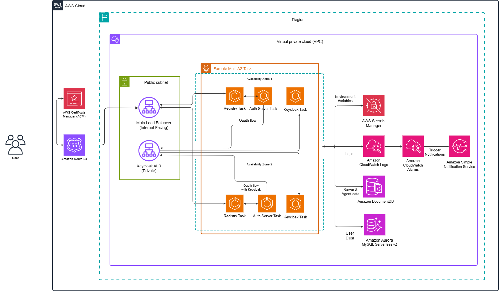

# MCP Gateway Registry - AWS ECS Infrastructure

Production-grade, multi-region infrastructure for the MCP Gateway Registry using AWS ECS Fargate, Aurora Serverless, and Keycloak authentication.

[](https://www.terraform.io/)
[](https://aws.amazon.com/ecs/)
[](https://aws.amazon.com/rds/aurora/)

## Table of Contents

- [Architecture](#architecture)
- [Prerequisites](#prerequisites)
- [Quick Start](#quick-start)
- [Regional Deployment](#regional-deployment)
- [Post-Deployment](#post-deployment)
- [Operations](#operations-and-maintenance)
- [Container Management](#container-build-and-deployment)
- [Troubleshooting](#troubleshooting)
- [Cost Optimization](#cost-optimization)
- [Security](#security-considerations)

## Architecture



### Network Architecture

The infrastructure is deployed within a dedicated VPC spanning two availability zones for high availability. User traffic enters through Route 53 DNS resolution, directing requests to either the Main ALB (for Registry and Auth Server) or the Keycloak ALB (for identity management). AWS Certificate Manager provisions and manages SSL/TLS certificates for secure HTTPS communication.

### Application Load Balancers

**Main ALB (Internet-Facing)**
- Deployed in public subnets across both availability zones
- Routes traffic to Registry and Auth Server tasks
- SSL termination with ACM certificates
- Health checks to ensure task availability
- Target groups with dynamic port mapping

**Keycloak ALB (Private Subnets)**
- Internal load balancer for Keycloak services
- Isolated from direct internet access
- Dedicated SSL certificate for Keycloak domain
- Health check endpoint monitoring

### ECS Cluster and Services

The infrastructure runs on an ECS cluster with Fargate launch type, eliminating server management. Three primary service types run as containerized tasks:

**Registry Tasks**
- MCP server registry and discovery service
- Auto-scaling group manages task count based on CPU/memory
- Deployed across both availability zones
- Retrieves secrets from AWS Secrets Manager
- Writes logs to CloudWatch Logs
- Stores server metadata in Amazon EFS

**Auth Server Tasks**
- OAuth2/OIDC authentication and authorization
- Session management and token validation
- Integrated with Keycloak for identity federation
- Auto-scales based on demand
- Stores user data in Aurora PostgreSQL Serverless

**Keycloak Tasks**
- Identity and access management
- User authentication and SSO
- Admin console for user management
- Connected to Aurora PostgreSQL for persistence
- Stores configuration in Amazon EFS

### Data Layer

**Amazon Aurora PostgreSQL Serverless v2**
- Auto-scaling database capacity (0.5 to 2 ACUs)
- Stores user credentials, sessions, and application data
- Automatic backups and point-in-time recovery
- Multi-AZ deployment for high availability
- RDS Proxy for connection pooling

**Amazon EFS (Elastic File System)**
- Shared persistent storage for Keycloak configuration
- Server metadata and registry information
- Accessible from all ECS tasks
- Automatic scaling and high availability

### Observability

**CloudWatch Logs**
- Centralized logging for all ECS tasks
- Separate log groups per service
- Log retention policies
- Integration with CloudWatch Alarms

**CloudWatch Alarms**
- CPU and memory utilization monitoring
- Database connection tracking
- HTTP error rate alerting
- Integration with Amazon SNS for notifications

**AWS Secrets Manager**
- Secure storage of sensitive credentials
- Keycloak admin credentials
- Database passwords
- Automatic rotation support
- Retrieved as environment variables by ECS tasks

## Quick Start

**Deploy in 5 steps:**

```bash
# 1. Clone and navigate
git clone <repository-url>
cd terraform/aws-ecs

# 2. Build and push containers to your target region
export AWS_REGION=us-east-1
cd ../.. && make build-push && cd terraform/aws-ecs

# 3. Configure deployment
cp terraform.tfvars.example terraform.tfvars
# Edit terraform.tfvars with your values (region, domain, IPs)

# 4. Deploy infrastructure
terraform init
terraform apply

# 5. Initialize Keycloak (after DNS propagates, ~10 minutes)
./scripts/init-keycloak.sh
```

## Prerequisites

### Required Tools

| Tool | Minimum Version | Installation |
|------|----------------|--------------|
| Terraform | >= 1.5.0 | [terraform.io/downloads](https://www.terraform.io/downloads) |
| AWS CLI | >= 2.0 | [docs.aws.amazon.com/cli](https://docs.aws.amazon.com/cli/latest/userguide/getting-started-install.html) |
| Docker | >= 20.10 | [docs.docker.com/engine/install](https://docs.docker.com/engine/install/) |
| Session Manager Plugin | Latest | [AWS SSM Plugin](https://docs.aws.amazon.com/systems-manager/latest/userguide/session-manager-working-with-install-plugin.html) |

**Verify installations:**
```bash
terraform version  # Should show >= 1.5.0
aws --version      # Should show >= 2.0
docker --version   # Should show >= 20.10
session-manager-plugin  # Should display version
```

### AWS Account Setup

**IAM Permissions Required:**

Create an IAM policy with these permissions (or use AdministratorAccess for testing):

<details>
<summary>Click to expand IAM policy JSON</summary>

```json
{
  "Version": "2012-10-17",
  "Statement": [
    {
      "Effect": "Allow",
      "Action": [
        "ec2:*",
        "ecs:*",
        "rds:*",
        "elasticloadbalancing:*",
        "route53:*",
        "acm:*",
        "iam:*",
        "logs:*",
        "elasticfilesystem:*",
        "secretsmanager:*",
        "ecr:*",
        "application-autoscaling:*",
        "cloudwatch:*",
        "sns:*"
      ],
      "Resource": "*"
    }
  ]
}
```
</details>

**Configure AWS CLI:**
```bash
# Method 1: Interactive configuration
aws configure
# AWS Access Key ID: YOUR_ACCESS_KEY
# AWS Secret Access Key: YOUR_SECRET_KEY
# Default region: us-east-1
# Default output format: json

# Method 2: Environment variables
export AWS_ACCESS_KEY_ID="YOUR_ACCESS_KEY"
export AWS_SECRET_ACCESS_KEY="YOUR_SECRET_KEY"
export AWS_REGION="us-east-1"

# Method 3: Named profile
aws configure --profile mcp-gateway
export AWS_PROFILE=mcp-gateway

# Verify credentials
aws sts get-caller-identity
```

### Domain Configuration

**You need a domain with Route53 hosted zone:**

```bash
# Option 1: Register domain through Route53
# Go to Route53 console > Registered domains > Register domain

# Option 2: Use existing domain - create hosted zone
aws route53 create-hosted-zone \
  --name mycorp.click \
  --caller-reference $(date +%s)

# Get nameservers from hosted zone
aws route53 list-hosted-zones --query 'HostedZones[?Name==`mycorp.click.`]'

# Update NS records at your domain registrar with Route53 nameservers
```

**Verify domain configuration:**
```bash
# Query domain nameservers
dig NS mycorp.click +short

# Should show Route53 nameservers like:
# ns-1234.awsdns-12.org.
# ns-5678.awsdns-56.com.
# ns-9012.awsdns-90.net.
# ns-3456.awsdns-34.co.uk.
```

### Important Notes

- **Cost Warning:** This infrastructure incurs AWS charges (~$110-250/month). See [Cost Optimization](#cost-optimization) for details.
- **Deployment Time:** First deployment takes 15-20 minutes (RDS provisioning is the slowest part).
- **Region Considerations:** All resources (ECR images, infrastructure) must be in the same AWS region.
- **State Management:** Terraform state is stored locally by default. For production, use S3 backend (see [Security](#security-considerations)).

## Regional Deployment

### Understanding Regional Configuration

The infrastructure supports two domain configuration modes:

#### 1. Regional Domains (Recommended for Multi-Region)
When `use_regional_domains = true`, domains are automatically constructed based on the deployment region:

```
Format: {service}.{region}.{base_domain}

Examples:
- us-east-1: kc.us-east-1.mycorp.click, registry.us-east-1.mycorp.click
- us-west-2: kc.us-west-2.mycorp.click, registry.us-west-2.mycorp.click
- eu-west-1: kc.eu-west-1.mycorp.click, registry.eu-west-1.mycorp.click
```

This mode is ideal when deploying to multiple regions, as it prevents domain conflicts and clearly identifies the region serving each request.

#### 2. Static Domains (Single Region Deployment)
When `use_regional_domains = false`, use custom static domains:

```hcl
use_regional_domains = false
keycloak_domain = "kc.mycorp.click"
root_domain = "mycorp.click"
```

### Key Configuration Files

#### terraform.tfvars (User Configuration)
Your deployment-specific values. This file is **not committed to git**.

**Critical parameters to configure:**

```hcl
# Region - MUST match where your ECR images are located
aws_region = "us-east-1"

# Domain Configuration
use_regional_domains = true
base_domain          = "mycorp.click"

# Container Images - Update region AND account ID in ALL URIs
# Get account ID: aws sts get-caller-identity --query Account --output text
registry_image_uri    = "YOUR_ACCOUNT_ID.dkr.ecr.us-east-1.amazonaws.com/mcp-gateway-registry:latest"
auth_server_image_uri = "YOUR_ACCOUNT_ID.dkr.ecr.us-east-1.amazonaws.com/mcp-gateway-auth-server:latest"
# ... (update all 7 image URIs - see Regional Deployment section for complete list)

# Network Access Control
# Get your IP: curl -s ifconfig.me
ingress_cidr_blocks = [
  "YOUR.IP.ADDRESS/32",  # Your office/home IP
]

# Credentials (CRITICAL: change for production)
keycloak_admin          = "admin"
keycloak_admin_password = "STRONG_PASSWORD_MIN_12_CHARS"
keycloak_database_username = "keycloak"
keycloak_database_password = "STRONG_DB_PASSWORD_MIN_12_CHARS"
```

#### locals.tf (Dynamic Values)
Computed values based on variables. **No changes needed** unless customizing domain logic.

```hcl
locals {
  # Automatic domain construction based on use_regional_domains flag
  keycloak_domain = var.use_regional_domains ? "kc.${var.aws_region}.${var.base_domain}" : var.keycloak_domain
  root_domain     = var.use_regional_domains ? "${var.aws_region}.${var.base_domain}" : var.root_domain
}
```

#### variables.tf (Variable Definitions)
Default values and variable types. Committed to git. **Only modify** if adding new variables or changing defaults.

### Deploying to a New Region

Follow these steps to deploy infrastructure in any AWS region:

**Step 1: Build and Push Container Images**

Container images must be built and pushed to ECR **in your target region** before terraform deployment.

```bash
# Set target region (CRITICAL: must match terraform.tfvars later)
export AWS_REGION=us-east-1

# Build and push all 12 container images (takes 20-30 minutes)
cd /path/to/mcp-gateway-registry
make build-push

# What happens during make build-push:
# 1. Reads build-config.yaml for image definitions
# 2. Logs into ECR in target region
# 3. Creates ECR repositories if they don't exist
# 4. Builds each Docker image:
#    - registry (MCP Gateway with nginx, ~2GB)
#    - auth_server (OAuth2 server, ~500MB)
#    - keycloak (Identity provider, ~800MB)
#    - 5 MCP servers (currenttime, mcpgw, etc.)
#    - 2 A2A agents (flight booking, travel assistant)
#    - 2 utility images (scopes_init, metrics_service)
# 5. Tags images with 'latest'
# 6. Pushes to ECR
# 7. Displays final ECR URIs
```

**Verify images were pushed:**
```bash
# List ECR repositories
aws ecr describe-repositories --region us-east-1 --query 'repositories[*].repositoryName'

# Check specific image exists
aws ecr describe-images \
  --repository-name mcp-gateway-registry \
  --region us-east-1 \
  --query 'imageDetails[0].{Tags:imageTags,Size:imageSizeInBytes,Pushed:imagePushedAt}'
```

**Troubleshooting image builds:**
```bash
# Build failed? Build specific image to debug
make build IMAGE=registry

# Check Docker daemon
docker ps

# Check AWS credentials
aws sts get-caller-identity

# Manual ECR login if needed
aws ecr get-login-password --region us-east-1 | \
  docker login --username AWS --password-stdin \
  $(aws sts get-caller-identity --query Account --output text).dkr.ecr.us-east-1.amazonaws.com
```

**Step 2: Create and Configure terraform.tfvars**

```bash
cd terraform/aws-ecs

# Copy example template
cp terraform.tfvars.example terraform.tfvars

# Edit with your values
vim terraform.tfvars  # or nano, code, etc.
```

**Critical parameters to update:**

```hcl
# ============================================================================
# REGION - Must match where you pushed ECR images
# ============================================================================
aws_region = "us-east-1"

# ============================================================================
# NETWORK ACCESS CONTROL - Add YOUR IP addresses
# ============================================================================
ingress_cidr_blocks = [
  "123.456.789.012/32",  # Your office IP
  "98.765.43.210/32",    # Your home IP
]

# Get your current IP:
# curl -s ifconfig.me

# ============================================================================
# DOMAIN CONFIGURATION
# ============================================================================
# Option 1: Regional domains (RECOMMENDED - auto-creates kc.us-east-1.mycorp.click)
use_regional_domains = true
base_domain          = "mycorp.click"  # Change to YOUR domain

# Option 2: Static domains (for single region only)
# use_regional_domains = false
# keycloak_domain = "kc.mycorp.click"
# root_domain     = "mycorp.click"

# ============================================================================
# CONTAINER IMAGE URIs - Update region AND account ID
# ============================================================================
# CRITICAL: Update BOTH the region and account ID in ALL URIs below
# Get your account ID: aws sts get-caller-identity --query Account --output text

registry_image_uri    = "YOUR_ACCOUNT_ID.dkr.ecr.us-east-1.amazonaws.com/mcp-gateway-registry:latest"
auth_server_image_uri = "YOUR_ACCOUNT_ID.dkr.ecr.us-east-1.amazonaws.com/mcp-gateway-auth-server:latest"
currenttime_image_uri = "YOUR_ACCOUNT_ID.dkr.ecr.us-east-1.amazonaws.com/mcp-gateway-currenttime:latest"
mcpgw_image_uri       = "YOUR_ACCOUNT_ID.dkr.ecr.us-east-1.amazonaws.com/mcp-gateway-mcpgw:latest"
realserverfaketools_image_uri = "YOUR_ACCOUNT_ID.dkr.ecr.us-east-1.amazonaws.com/mcp-gateway-realserverfaketools:latest"
flight_booking_agent_image_uri   = "YOUR_ACCOUNT_ID.dkr.ecr.us-east-1.amazonaws.com/mcp-gateway-flight-booking-agent:latest"
travel_assistant_agent_image_uri = "YOUR_ACCOUNT_ID.dkr.ecr.us-east-1.amazonaws.com/mcp-gateway-travel-assistant-agent:latest"

# ============================================================================
# CREDENTIALS - CHANGE THESE FOR PRODUCTION
# ============================================================================
keycloak_admin          = "admin"
keycloak_admin_password = "CHANGE_ME_STRONG_PASSWORD_123!"  # min 12 chars

keycloak_database_username = "keycloak"
keycloak_database_password = "CHANGE_ME_DB_PASSWORD_456!"   # min 12 chars
```

**Quick configuration script:**
```bash
# Get your AWS account ID and IP automatically
AWS_ACCOUNT_ID=$(aws sts get-caller-identity --query Account --output text)
MY_IP=$(curl -s ifconfig.me)

echo "Your AWS Account ID: $AWS_ACCOUNT_ID"
echo "Your Public IP: $MY_IP"

# Use these values when editing terraform.tfvars
```

**Step 3: Deploy Infrastructure**

```bash
# Initialize Terraform (downloads AWS provider, creates state file)
terraform init

# Validate configuration syntax
terraform validate

# See what will be created (DRY RUN)
terraform plan

# Review the plan output carefully:
# - Should create ~50-70 resources
# - Check VPC CIDR, region, domain names
# - Verify ECR image URIs are correct

# Apply the configuration (creates actual AWS resources)
terraform apply
# Type 'yes' when prompted
```

**Expected output:**
```
Plan: 67 to add, 0 to change, 0 to destroy.

Do you want to perform these actions?
  Terraform will perform the actions described above.
  Only 'yes' will be accepted to approve.

  Enter a value: yes

aws_vpc.main: Creating...
aws_efs_file_system.keycloak: Creating...
...
[15-20 minutes of resource creation]
...
Apply complete! Resources: 67 added, 0 changed, 0 destroyed.

Outputs:

keycloak_url = "https://kc.us-east-1.mycorp.click"
registry_url = "https://registry.us-east-1.mycorp.click"
main_alb_dns = "mcp-gateway-alb-1234567890.us-east-1.elb.amazonaws.com"
```

**Step 4: Wait for Infrastructure Stabilization**

| Component | Time | What's Happening |
|-----------|------|------------------|
| RDS Aurora Cluster | ~10 min | Database provisioning, multi-AZ setup |
| ECS Tasks | ~5 min | Container pulls, health checks |
| ACM Certificates | ~5 min | DNS validation, SSL provisioning |
| DNS Propagation | ~5-10 min | Route53 records worldwide update |

**Monitor deployment progress:**
```bash
# Check ECS services status
watch -n 10 'aws ecs describe-services \
  --cluster mcp-gateway-ecs-cluster \
  --services mcp-gateway-v2-registry mcp-gateway-v2-auth keycloak \
  --region us-east-1 \
  --query "services[*].{Service:serviceName,Running:runningCount,Desired:desiredCount}" \
  --output table'

# When Running = Desired for all services, proceed to next step
```

## Post-Deployment

Critical steps to complete **after** `terraform apply` finishes successfully.

### Step 1: Verify Infrastructure Deployment

**Check Terraform Outputs:**

```bash
# Display all terraform outputs
terraform output

# Expected outputs:
registry_url = "https://registry.us-east-1.mycorp.click"
keycloak_url = "https://kc.us-east-1.mycorp.click"
main_alb_dns = "mcp-gateway-alb-1234567890.us-east-1.elb.amazonaws.com"
keycloak_alb_dns = "mcp-gateway-kc-alb-0987654321.us-east-1.elb.amazonaws.com"
ecs_cluster_name = "mcp-gateway-ecs-cluster"
registry_service_name = "mcp-gateway-v2-registry"
auth_service_name = "mcp-gateway-v2-auth"
keycloak_service_name = "keycloak"
rds_cluster_endpoint = "mcp-gateway-keycloak-cluster.cluster-xxx.us-east-1.rds.amazonaws.com"
```

### Step 2: Wait for DNS Propagation

DNS changes typically take 5-10 minutes to propagate globally. **Do not proceed** until DNS resolves correctly.

```bash
# Test DNS resolution (should return ALB IP address)
nslookup kc.us-east-1.mycorp.click
nslookup registry.us-east-1.mycorp.click

# Or use dig for cleaner output
dig +short kc.us-east-1.mycorp.click
dig +short registry.us-east-1.mycorp.click

# Expected: Returns IP address like 3.216.xxx.xxx

# Test SSL certificate (should return 200 OK or 404, not SSL error)
curl -I https://kc.us-east-1.mycorp.click/health
curl -I https://registry.us-east-1.mycorp.click/health

# If you see "Could not resolve host" -> Wait longer
# If you see "SSL certificate problem" -> ACM validation still in progress
# If you see "200 OK" or "404 Not Found" -> DNS and SSL working!
```

### Step 3: Verify ECS Services are Running

All ECS services must reach desired capacity before proceeding.

```bash
# Set region
export AWS_REGION=us-east-1

# Check all services in one command
aws ecs describe-services \
  --cluster mcp-gateway-ecs-cluster \
  --services mcp-gateway-v2-registry mcp-gateway-v2-auth keycloak \
  --region $AWS_REGION \
  --query 'services[*].{Service:serviceName,Status:status,Running:runningCount,Desired:desiredCount,LastEvent:events[0].message}' \
  --output table

# Expected output (Running = Desired for all):
# -----------------------------------------------------------------------
# |                         DescribeServices                           |
# +----------------------------------+----------+---------+----------+--+
# |  Desired  | LastEvent           | Running  | Service  | Status   |
# +----------------------------------+----------+---------+----------+--+
# |  2        | service is healthy  | 2        | mcp-gateway-v2-registry | ACTIVE |
# |  2        | service is healthy  | 2        | mcp-gateway-v2-auth     | ACTIVE |
# |  2        | service is healthy  | 2        | keycloak                | ACTIVE |
# +----------------------------------+----------+---------+----------+--+

# If Running < Desired, check task logs:
aws ecs describe-services \
  --cluster mcp-gateway-ecs-cluster \
  --services mcp-gateway-v2-registry \
  --region $AWS_REGION \
  --query 'services[0].events[:5]' \
  --output table
```

### Step 4: Initialize Keycloak (CRITICAL)

**This step is mandatory.** It creates the Keycloak realm, OAuth2 clients, user roles, and MCP server scopes.

```bash
cd terraform/aws-ecs

# Set environment variables (update with your values)
export AWS_REGION=us-east-1
export KEYCLOAK_ADMIN_URL="https://kc.us-east-1.mycorp.click"
export KEYCLOAK_REALM="mcp-gateway"
export KEYCLOAK_ADMIN="admin"
export KEYCLOAK_ADMIN_PASSWORD="YOUR_PASSWORD_FROM_TFVARS"  # From terraform.tfvars

# Run initialization script
./scripts/init-keycloak.sh
```

**What the script does:**
1. Tests Keycloak connectivity
2. Creates `mcp-gateway` realm
3. Configures OAuth2/OIDC clients:
   - `mcp-gateway-web` (web application)
   - `mcp-gateway-api` (API access)
4. Sets up user roles and permissions
5. Initializes MCP server scopes
6. Creates test users (if configured)

**Expected output:**
```
Checking Keycloak connectivity...
✓ Keycloak is accessible at https://kc.us-east-1.mycorp.click

Creating realm 'mcp-gateway'...
✓ Realm created successfully

Configuring OAuth2 client 'mcp-gateway-web'...
✓ Client created with ID: abc123-def456-ghi789

Setting up user roles...
✓ Role 'admin' created
✓ Role 'user' created

Initializing MCP server scopes...
✓ Scopes initialized

✓ Keycloak initialization complete!

Next steps:
1. Access admin console: https://kc.us-east-1.mycorp.click/admin
2. Login with: admin / YOUR_PASSWORD
3. Create additional users in the 'mcp-gateway' realm
```

**Troubleshooting init-keycloak.sh:**
```bash
# Script fails with "Connection refused"
# → DNS not propagated yet, wait 5 more minutes

# Script fails with "SSL certificate problem"
# → ACM validation incomplete, wait 5 more minutes

# Script fails with "401 Unauthorized"
# → Check KEYCLOAK_ADMIN_PASSWORD matches terraform.tfvars

# Script fails with "Realm already exists"
# → Already initialized, safe to ignore or delete realm in UI first
```

### Step 5: Verify Application Access

Test all endpoints to ensure complete deployment:

```bash
# 1. Test Keycloak Admin Console (browser)
open https://kc.us-east-1.mycorp.click/admin
# Login: admin / YOUR_PASSWORD

# 2. Test Registry API
curl https://registry.us-east-1.mycorp.click/health
# Expected: {"status": "healthy"}

curl https://registry.us-east-1.mycorp.click/api/servers
# Expected: [] or list of servers

# 3. Test Auth Server
curl https://registry.us-east-1.mycorp.click/auth/health
# Expected: {"status": "ok"}

# 4. Test Keycloak realm endpoint
curl https://kc.us-east-1.mycorp.click/realms/mcp-gateway
# Expected: JSON with realm configuration
```

### Step 6: Review Logs (Verify No Errors)

```bash
cd terraform/aws-ecs

# Check for errors across all services (last 10 minutes)
./scripts/view-cloudwatch-logs.sh --minutes 10 --filter "ERROR|FATAL|Exception"

# If errors found, view full context for specific service
./scripts/view-cloudwatch-logs.sh --component registry --minutes 30
./scripts/view-cloudwatch-logs.sh --component keycloak --minutes 30
./scripts/view-cloudwatch-logs.sh --component auth-server --minutes 30

# Common startup errors to ignore:
# - "Waiting for database..." (normal during RDS startup)
# - "Connection refused" in first 2-3 minutes (normal)
# - "Health check failed" during task startup (normal)

# Real errors to investigate:
# - "Authentication failed"
# - "Database connection pool exhausted"
# - "Out of memory"
# - "Permission denied"
```

### Step 7: Test End-to-End Workflow

Verify the complete MCP server registration and discovery flow:

```bash
# 1. Register a test MCP server
curl -X POST https://registry.us-east-1.mycorp.click/api/servers \
  -H "Content-Type: application/json" \
  -d '{
    "name": "test-server",
    "description": "Test MCP Server",
    "url": "https://example.com/mcp",
    "category": "utilities"
  }'

# Expected: {"id": "...", "name": "test-server", "status": "registered"}

# 2. List all registered servers
curl https://registry.us-east-1.mycorp.click/api/servers

# Expected: [{...test-server...}]

# 3. Search for server
curl "https://registry.us-east-1.mycorp.click/api/servers?search=test"

# Expected: [{...test-server...}]

# 4. Get server details
SERVER_ID="<id-from-step-1>"
curl "https://registry.us-east-1.mycorp.click/api/servers/$SERVER_ID"

# Expected: {...server details...}

# 5. Delete test server (cleanup)
curl -X DELETE "https://registry.us-east-1.mycorp.click/api/servers/$SERVER_ID"

# Expected: {"status": "deleted"}
```

**Deployment Complete!** Your MCP Gateway Registry is now fully operational.

## Operations and Maintenance

### Accessing ECS Tasks

#### SSH into Running Tasks

Use the provided script to get shell access to any running ECS task:

```bash
cd terraform/aws-ecs

# Connect to Registry task
./scripts/ecs-ssh.sh registry

# Connect to Auth Server task
./scripts/ecs-ssh.sh auth-server

# Connect to Keycloak task
./scripts/ecs-ssh.sh keycloak

# Specify custom cluster or region
./scripts/ecs-ssh.sh registry mcp-gateway-ecs-cluster us-east-1
```

The script automatically:
- Finds the first running task for the specified service
- Establishes an interactive session using AWS Systems Manager
- No SSH keys or bastion hosts required

**Requirements:**
- Session Manager plugin installed: `aws ssm install-plugin`
- IAM permissions for `ecs:ExecuteCommand` and `ssm:StartSession`
- ECS tasks must have `enableExecuteCommand` enabled (already configured)

#### Manual ECS Access

```bash
# List all tasks in cluster
aws ecs list-tasks --cluster mcp-gateway-ecs-cluster --region us-east-1

# Get specific task details
aws ecs describe-tasks \
  --cluster mcp-gateway-ecs-cluster \
  --tasks TASK_ARN \
  --region us-east-1

# Execute command in running task
aws ecs execute-command \
  --cluster mcp-gateway-ecs-cluster \
  --task TASK_ARN \
  --container registry \
  --interactive \
  --command "/bin/bash" \
  --region us-east-1
```

### Viewing Logs

#### Using CloudWatch Logs Script

```bash
cd terraform/aws-ecs

# Basic usage - last 30 minutes, all components
./scripts/view-cloudwatch-logs.sh

# Component-specific logs
./scripts/view-cloudwatch-logs.sh --component keycloak
./scripts/view-cloudwatch-logs.sh --component registry
./scripts/view-cloudwatch-logs.sh --component auth-server

# Custom time range
./scripts/view-cloudwatch-logs.sh --minutes 60  # Last hour
./scripts/view-cloudwatch-logs.sh --minutes 5   # Last 5 minutes

# Live tail (real-time streaming)
./scripts/view-cloudwatch-logs.sh --follow

# Filter by pattern (regex)
./scripts/view-cloudwatch-logs.sh --filter "ERROR|WARN"
./scripts/view-cloudwatch-logs.sh --filter "database connection"

# Specific time range
./scripts/view-cloudwatch-logs.sh \
  --start-time 2024-01-15T10:00:00Z \
  --end-time 2024-01-15T11:00:00Z

# Combine options
./scripts/view-cloudwatch-logs.sh \
  --component registry \
  --minutes 15 \
  --filter "ERROR"
```

#### Direct CloudWatch Access

```bash
# List log groups
aws logs describe-log-groups \
  --log-group-name-prefix "/aws/ecs/mcp-gateway" \
  --region us-east-1

# Get specific log streams
aws logs describe-log-streams \
  --log-group-name "/aws/ecs/mcp-gateway-registry" \
  --order-by LastEventTime \
  --descending \
  --max-items 5 \
  --region us-east-1

# Tail logs in real-time
aws logs tail "/aws/ecs/mcp-gateway-registry" \
  --follow \
  --region us-east-1

# Filter and query logs
aws logs filter-log-events \
  --log-group-name "/aws/ecs/mcp-gateway-registry" \
  --start-time $(date -u -d '30 minutes ago' +%s)000 \
  --filter-pattern "ERROR" \
  --region us-east-1
```

## Container Build and Deployment

### Understanding the Build System

The repository uses a unified container build system with `build-config.yaml` as the **single source of truth**.

**All 12 Container Images:**

| Image Name | Purpose | Size | Build Time |
|------------|---------|------|------------|
| `registry` | MCP Gateway with nginx, FAISS, ML models | ~2GB | ~8 min |
| `auth_server` | OAuth2/OIDC authentication server | ~500MB | ~3 min |
| `keycloak` | Identity provider (Keycloak + custom config) | ~800MB | ~2 min |
| `scopes_init` | Keycloak scope initialization utility | ~200MB | ~2 min |
| `metrics_service` | Metrics collection and monitoring | ~300MB | ~2 min |
| `currenttime` | Example MCP server (current time) | ~100MB | ~1 min |
| `mcpgw` | MCP Gateway example server | ~100MB | ~1 min |
| `realserverfaketools` | Testing MCP server | ~100MB | ~1 min |
| `fininfo` | Financial information MCP server | ~100MB | ~1 min |
| `mcp_server` | Generic MCP server template | ~100MB | ~1 min |
| `flight_booking_agent` | A2A agent for flight booking | ~400MB | ~3 min |
| `travel_assistant_agent` | A2A agent for travel assistance | ~400MB | ~3 min |

**Total:** ~5GB across all images, ~30 minutes for complete build.

### Building Container Images

**Prerequisites:**
```bash
# Verify Docker is running
docker ps

# Set target region
export AWS_REGION=us-east-1

# Verify AWS credentials
aws sts get-caller-identity
```

**Build Commands:**

```bash
# From repository root
cd /path/to/mcp-gateway-registry

# ==============================================================================
# BUILD ONLY (Local Testing)
# ==============================================================================
# Build all 12 images locally (no push)
make build

# Build specific image
make build IMAGE=registry
make build IMAGE=auth_server
make build IMAGE=keycloak

# Build multiple specific images
make build IMAGE=registry && make build IMAGE=auth_server

# ==============================================================================
# PUSH ONLY (After Local Build)
# ==============================================================================
# Push all built images to ECR
make push

# Push specific image
make push IMAGE=registry

# ==============================================================================
# BUILD + PUSH (Recommended for Deployment)
# ==============================================================================
# Build and push all images (full deployment)
make build-push

# Build and push specific image (faster updates)
make build-push IMAGE=registry
make build-push IMAGE=auth_server
make build-push IMAGE=metrics_service

# ==============================================================================
# AGENT-SPECIFIC BUILDS
# ==============================================================================
# Build both A2A agents
make build-agents

# Push both A2A agents
make push-agents
```

**What Happens During `make build-push`:**

```
1. Reads build-config.yaml for image definitions
2. Authenticates with ECR: aws ecr get-login-password
3. Creates ECR repositories (if don't exist)
4. For each image:
   a. Builds Docker image with specified dockerfile and context
   b. Tags with latest and optional custom tags
   c. Pushes to ECR repository
5. Displays summary with all ECR URIs
```

**Example Output:**
```
[INFO] AWS Account: 123456789012
[INFO] ECR Registry: 123456789012.dkr.ecr.us-east-1.amazonaws.com
[INFO] AWS Region: us-east-1
[INFO] Build Action: build-push
[INFO] Processing all 12 images...

[INFO] ==========================================
[INFO] Processing: registry (mcp-gateway-registry)
[INFO] ==========================================
[INFO] Building registry...
[+] Building 480.2s (20/20) FINISHED
 => [internal] load build definition
 => [internal] load .dockerignore
 => [internal] load metadata for docker.io/library/python:3.12-slim
 ...
[INFO] ✓ Successfully built registry
[INFO] Pushing registry to ECR...
[INFO] ✓ Successfully pushed: 123456789012.dkr.ecr.us-east-1.amazonaws.com/mcp-gateway-registry:latest

...
[INFO] ==========================================
[INFO] Build Summary
[INFO] ==========================================
[INFO] Successfully processed 12/12 images
[INFO] Total build time: 28 minutes 15 seconds
```

### Updating Running Services

After pushing a new container image to ECR, trigger a deployment to update running ECS tasks.

**Service Deployment Mapping:**

| Service Name | ECS Cluster | Container Image | Typical Update Reason |
|--------------|-------------|-----------------|----------------------|
| `mcp-gateway-v2-registry` | `mcp-gateway-ecs-cluster` | `registry` | API changes, bug fixes |
| `mcp-gateway-v2-auth` | `mcp-gateway-ecs-cluster` | `auth_server` | Auth logic updates |
| `keycloak` | `keycloak` | `keycloak` | Custom Keycloak config |

**Update Commands:**

```bash
# Set region
export AWS_REGION=us-east-1

# ============================================================================
# UPDATE REGISTRY SERVICE
# ============================================================================
aws ecs update-service \
  --cluster mcp-gateway-ecs-cluster \
  --service mcp-gateway-v2-registry \
  --force-new-deployment \
  --region $AWS_REGION \
  --output table

# ============================================================================
# UPDATE AUTH SERVER SERVICE
# ============================================================================
aws ecs update-service \
  --cluster mcp-gateway-ecs-cluster \
  --service mcp-gateway-v2-auth \
  --force-new-deployment \
  --region $AWS_REGION \
  --output table

# ============================================================================
# UPDATE KEYCLOAK SERVICE
# ============================================================================
aws ecs update-service \
  --cluster keycloak \
  --service keycloak \
  --force-new-deployment \
  --region $AWS_REGION \
  --output table
```

**What `--force-new-deployment` does:**
1. Stops existing tasks gracefully (30 second drain period)
2. Pulls latest image from ECR (even if tag is same)
3. Starts new tasks with new container
4. Waits for health checks to pass
5. Continues rolling deployment until all tasks updated

**Monitor Deployment Progress:**

```bash
# Method 1: Watch service status (auto-refreshing)
watch -n 5 'aws ecs describe-services \
  --cluster mcp-gateway-ecs-cluster \
  --services mcp-gateway-v2-registry \
  --region us-east-1 \
  --query "services[0].{Running:runningCount,Desired:desiredCount,Status:status,Deployment:deployments[0].status}" \
  --output table'

# Exit watch with Ctrl+C when Running = Desired

# Method 2: Check deployment status once
aws ecs describe-services \
  --cluster mcp-gateway-ecs-cluster \
  --services mcp-gateway-v2-registry \
  --region $AWS_REGION \
  --query 'services[0].{ServiceName:serviceName,Status:status,RunningCount:runningCount,DesiredCount:desiredCount,Deployments:deployments[*].{Status:status,Running:runningCount,Desired:desiredCount,TaskDef:taskDefinition}}' \
  --output json

# Method 3: View recent service events
aws ecs describe-services \
  --cluster mcp-gateway-ecs-cluster \
  --services mcp-gateway-v2-registry \
  --region $AWS_REGION \
  --query 'services[0].events[:10]' \
  --output table

# Method 4: List all running tasks
aws ecs list-tasks \
  --cluster mcp-gateway-ecs-cluster \
  --service-name mcp-gateway-v2-registry \
  --region $AWS_REGION

# Method 5: Get specific task details
aws ecs describe-tasks \
  --cluster mcp-gateway-ecs-cluster \
  --tasks TASK_ARN \
  --region $AWS_REGION \
  --query 'tasks[0].{TaskArn:taskArn,Status:lastStatus,Health:healthStatus,StartedAt:startedAt,Containers:containers[*].{Name:name,Status:lastStatus,Health:healthStatus}}'
```

### Complete Developer Workflow

**Scenario:** You fixed a bug in the Registry API and want to deploy it.

```bash
# ============================================================================
# STEP 1: Make Code Changes
# ============================================================================
cd /path/to/mcp-gateway-registry
vim registry/api/server_routes.py  # Fix bug

# ============================================================================
# STEP 2: Test Locally (Optional but Recommended)
# ============================================================================
# Build image locally
docker build -f docker/Dockerfile.registry -t registry:test .

# Run locally
docker run -p 7860:7860 registry:test

# Test endpoint
curl http://localhost:7860/health

# Stop test container
docker stop $(docker ps -q --filter ancestor=registry:test)

# ============================================================================
# STEP 3: Build and Push to ECR
# ============================================================================
export AWS_REGION=us-east-1
make build-push IMAGE=registry

# Verify push succeeded
aws ecr describe-images \
  --repository-name mcp-gateway-registry \
  --region $AWS_REGION \
  --query 'imageDetails[0].{Tags:imageTags,Pushed:imagePushedAt,Size:imageSizeInBytes}'

# ============================================================================
# STEP 4: Deploy to ECS
# ============================================================================
aws ecs update-service \
  --cluster mcp-gateway-ecs-cluster \
  --service mcp-gateway-v2-registry \
  --force-new-deployment \
  --region $AWS_REGION

# ============================================================================
# STEP 5: Monitor Deployment
# ============================================================================
# Watch logs in real-time
cd terraform/aws-ecs
./scripts/view-cloudwatch-logs.sh --component registry --follow

# In another terminal, check service status
watch -n 10 'aws ecs describe-services \
  --cluster mcp-gateway-ecs-cluster \
  --services mcp-gateway-v2-registry \
  --region us-east-1 \
  --query "services[0].{Running:runningCount,Desired:desiredCount}" \
  --output table'

# ============================================================================
# STEP 6: Verify Deployment
# ============================================================================
# Test health endpoint
curl https://registry.us-east-1.mycorp.click/health

# Test your specific fix
curl https://registry.us-east-1.mycorp.click/api/your-fixed-endpoint

# Check for errors in logs (last 5 minutes)
./scripts/view-cloudwatch-logs.sh --component registry --minutes 5 --filter "ERROR"
```

### Deployment Troubleshooting

**Deployment stuck / tasks not starting:**
```bash
# Check service events for errors
aws ecs describe-services \
  --cluster mcp-gateway-ecs-cluster \
  --services mcp-gateway-v2-registry \
  --region $AWS_REGION \
  --query 'services[0].events[:15]' \
  --output table

# Common issues:
# - "Ecouldn't pull image" → ECR permissions or wrong image URI
# - "CannotPullContainerError" → Image doesn't exist in ECR
# - "Task failed container health checks" → Application not starting correctly
# - "Service is unable to place a task" → No capacity or resource constraints

# Check stopped tasks for failure reason
aws ecs list-tasks \
  --cluster mcp-gateway-ecs-cluster \
  --service-name mcp-gateway-v2-registry \
  --desired-status STOPPED \
  --region $AWS_REGION \
  --max-items 5

aws ecs describe-tasks \
  --cluster mcp-gateway-ecs-cluster \
  --tasks STOPPED_TASK_ARN \
  --region $AWS_REGION \
  --query 'tasks[0].{StoppedReason:stoppedReason,Containers:containers[*].{Name:name,Reason:reason,ExitCode:exitCode}}'
```

### Rolling Back Deployments

**Quick rollback to previous working version:**

```bash
# Method 1: Rollback to specific task definition revision
# List recent task definitions
aws ecs list-task-definitions \
  --family-prefix mcp-gateway-registry \
  --sort DESC \
  --max-items 10 \
  --region $AWS_REGION

# Deploy specific (previous) revision
aws ecs update-service \
  --cluster mcp-gateway-ecs-cluster \
  --service mcp-gateway-v2-registry \
  --task-definition mcp-gateway-registry:42 \
  --region $AWS_REGION

# Method 2: Redeploy current task definition (if image was bad)
# First, rebuild and push fixed image with same tag
make build-push IMAGE=registry

# Then force new deployment to pull updated image
aws ecs update-service \
  --cluster mcp-gateway-ecs-cluster \
  --service mcp-gateway-v2-registry \
  --force-new-deployment \
  --region $AWS_REGION

# Method 3: Emergency rollback script
cat > rollback-registry.sh << 'EOF'
#!/bin/bash
set -e
export AWS_REGION=us-east-1

echo "Rolling back registry service..."
PREVIOUS_REVISION=$(aws ecs describe-services \
  --cluster mcp-gateway-ecs-cluster \
  --services mcp-gateway-v2-registry \
  --region $AWS_REGION \
  --query 'services[0].deployments[1].taskDefinition' \
  --output text)

aws ecs update-service \
  --cluster mcp-gateway-ecs-cluster \
  --service mcp-gateway-v2-registry \
  --task-definition $PREVIOUS_REVISION \
  --region $AWS_REGION

echo "Rollback initiated to: $PREVIOUS_REVISION"
EOF

chmod +x rollback-registry.sh
./rollback-registry.sh
```

### Blue/Green Deployment Strategy

For zero-downtime updates with instant rollback capability:

```bash
# 1. Update service with new task definition (auto blue/green)
aws ecs update-service \
  --cluster mcp-gateway-ecs-cluster \
  --service mcp-gateway-v2-registry \
  --force-new-deployment \
  --region $AWS_REGION

# ECS automatically performs rolling update:
# - Starts new task (green)
# - Waits for health check
# - Drains old task (blue)
# - Removes old task
# - Repeats for remaining tasks

# 2. Monitor health during deployment
watch -n 5 'curl -s https://registry.us-east-1.mycorp.click/health | jq .'

# 3. If issues detected, rollback immediately
aws ecs update-service \
  --cluster mcp-gateway-ecs-cluster \
  --service mcp-gateway-v2-registry \
  --task-definition <PREVIOUS_REVISION> \
  --region $AWS_REGION
```

## Troubleshooting

### Common Issues

#### DNS Not Resolving
```bash
# Check Route53 hosted zone
aws route53 list-hosted-zones --query "HostedZones[?Name=='mycorp.click.']"

# Check DNS records
aws route53 list-resource-record-sets \
  --hosted-zone-id ZONE_ID \
  --query "ResourceRecordSets[?Type=='CNAME']"

# Wait 5-10 minutes for propagation
# Test with different DNS servers
dig @8.8.8.8 kc.us-east-1.mycorp.click
dig @1.1.1.1 registry.us-east-1.mycorp.click
```

#### ECS Tasks Not Starting
```bash
# Check service events
aws ecs describe-services \
  --cluster mcp-gateway-ecs-cluster \
  --services mcp-gateway-v2-registry \
  --region $AWS_REGION \
  --query 'services[0].events[:10]' \
  --output table

# Check task stopped reason
aws ecs describe-tasks \
  --cluster mcp-gateway-ecs-cluster \
  --tasks TASK_ARN \
  --region $AWS_REGION \
  --query 'tasks[0].{StoppedReason:stoppedReason,Containers:containers[*].{Name:name,Reason:reason}}'

# Common causes:
# - ECR image pull failure (wrong region or permissions)
# - Resource limits (insufficient CPU/memory)
# - Invalid environment variables
# - Secrets Manager access denied
```

#### SSL Certificate Validation Pending
```bash
# Check certificate status
aws acm list-certificates --region $AWS_REGION

# Get certificate details
aws acm describe-certificate \
  --certificate-arn CERT_ARN \
  --region $AWS_REGION

# DNS validation may take 5-30 minutes
# Ensure Route53 hosted zone is correct
# Check CNAME validation records exist
```

#### Database Connection Failures
```bash
# Check RDS cluster status
aws rds describe-db-clusters \
  --db-cluster-identifier mcp-gateway-keycloak-cluster \
  --region $AWS_REGION \
  --query 'DBClusters[0].{Status:Status,Endpoint:Endpoint}'

# Check security group rules
aws ec2 describe-security-groups \
  --group-ids sg-xxx \
  --region $AWS_REGION

# Verify database credentials in Secrets Manager
aws secretsmanager get-secret-value \
  --secret-id /mcp-gateway/keycloak/db-password \
  --region $AWS_REGION
```

### Getting Help

Check logs first:
```bash
./scripts/view-cloudwatch-logs.sh --filter "ERROR|FATAL|Exception"
```

Review Terraform state:
```bash
terraform show
terraform state list
terraform state show aws_ecs_service.registry
```

## Cost Optimization

### Estimated Monthly Costs (us-east-1)

| Resource | Configuration | Estimated Cost |
|----------|--------------|----------------|
| RDS Aurora Serverless v2 | 0.5-2 ACU, PostgreSQL | $40-100/month |
| ECS Fargate Tasks | 3 services, 0.25 vCPU, 0.5GB each | $20-50/month |
| Application Load Balancers | 2 ALBs | $32-50/month |
| EFS | 5GB storage | $1.50/month |
| CloudWatch Logs | 10GB/month | $5/month |
| Data Transfer | 100GB/month | $9/month |
| **Total** | | **~$110-250/month** |

### Cost Reduction Strategies

**1. Use Aurora Serverless v2 auto-pause**
```hcl
keycloak_database_min_acu = 0.5  # Scale down to minimum
keycloak_database_max_acu = 1.0  # Lower max capacity
```

**2. Reduce ECS task count for non-prod**
```hcl
registry_replicas = 1    # Down from 2
auth_server_replicas = 1 # Down from 2
```

**3. Use internal ALB for Keycloak in production**
```hcl
keycloak_alb_scheme = "internal"
```

**4. Enable CloudWatch log retention**
```hcl
# Already configured - logs expire after 7 days
```

**5. Use Fargate Spot for non-critical workloads**
```hcl
capacity_provider_strategy = {
  base = 1  # Keep 1 on-demand
  weight = 1  # Use Spot for additional tasks
}
```

## Security Considerations

### Network Security
- All traffic encrypted with TLS (ACM certificates)
- Security groups restrict access to approved CIDR blocks only
- Keycloak ALB can be internal-only for production
- NAT Gateway for outbound internet access from private subnets

### Secrets Management
- All credentials stored in AWS Secrets Manager
- Automatic rotation supported (configure separately)
- ECS tasks retrieve secrets at runtime
- Never log or expose credentials

### IAM Permissions
- ECS task roles follow principle of least privilege
- Separate execution role for pulling images and secrets
- Task role for application-specific AWS API access
- Regular audit of IAM policies recommended

### Database Security
- RDS in private subnets only
- Encryption at rest enabled
- Encryption in transit (SSL)
- Automated backups enabled
- Security group limits access to ECS tasks only

### Best Practices
```bash
# Rotate Keycloak admin password
./scripts/rotate-keycloak-web-client-secret.sh

# Enable MFA for AWS console access
aws iam enable-mfa-device --user-name admin

# Use IAM roles for ECS tasks (already configured)
# Avoid hardcoding credentials in environment variables

# Regularly update container images
make build-push
aws ecs update-service --cluster mcp-gateway-ecs-cluster --service mcp-gateway-v2-registry --force-new-deployment --region us-east-1

# Enable AWS CloudTrail for audit logs
# Enable AWS Config for compliance monitoring
# Use AWS Security Hub for security posture management
```

## Backup and Disaster Recovery

### RDS Automated Backups
```bash
# Backups enabled by default (7 day retention)
# Point-in-time recovery available

# Create manual snapshot
aws rds create-db-cluster-snapshot \
  --db-cluster-identifier mcp-gateway-keycloak-cluster \
  --db-cluster-snapshot-identifier manual-backup-$(date +%Y%m%d) \
  --region $AWS_REGION

# List snapshots
aws rds describe-db-cluster-snapshots \
  --db-cluster-identifier mcp-gateway-keycloak-cluster \
  --region $AWS_REGION

# Restore from snapshot (requires terraform changes)
```

### EFS Backup
```bash
# EFS backup to AWS Backup (configure in AWS Backup console)
# Or use EFS-to-EFS replication for cross-region DR
```

### Terraform State Backup
```bash
# Local state - backup manually
cp terraform.tfstate terraform.tfstate.backup

# S3 backend (recommended for production)
terraform {
  backend "s3" {
    bucket         = "your-terraform-state-bucket"
    key            = "mcp-gateway/terraform.tfstate"
    region         = "us-east-1"
    encrypt        = true
    dynamodb_table = "terraform-lock-table"
  }
}
```

## Additional Resources

- [ECS Best Practices](https://docs.aws.amazon.com/AmazonECS/latest/bestpracticesguide/)
- [Aurora Serverless v2 Documentation](https://docs.aws.amazon.com/AmazonRDS/latest/AuroraUserGuide/aurora-serverless-v2.html)
- [Application Load Balancer Guide](https://docs.aws.amazon.com/elasticloadbalancing/latest/application/)
- [Keycloak Documentation](https://www.keycloak.org/documentation)
- [Session Manager Plugin Installation](https://docs.aws.amazon.com/systems-manager/latest/userguide/session-manager-working-with-install-plugin.html)

## Quick Reference

### Common Commands Cheat Sheet

```bash
# ============================================================================
# DEPLOYMENT
# ============================================================================
# Initial deployment
export AWS_REGION=us-east-1
make build-push                    # Build and push all images (~30 min)
terraform init && terraform apply  # Deploy infrastructure (~20 min)
./scripts/init-keycloak.sh         # Initialize Keycloak

# ============================================================================
# UPDATES
# ============================================================================
# Update specific service
make build-push IMAGE=registry
aws ecs update-service --cluster mcp-gateway-ecs-cluster --service mcp-gateway-v2-registry --force-new-deployment --region us-east-1

# ============================================================================
# MONITORING
# ============================================================================
# View logs
./scripts/view-cloudwatch-logs.sh --component registry --follow
./scripts/view-cloudwatch-logs.sh --filter "ERROR"

# Check service status
aws ecs describe-services --cluster mcp-gateway-ecs-cluster --services mcp-gateway-v2-registry --region us-east-1 --query 'services[0].{Running:runningCount,Desired:desiredCount}' --output table

# ============================================================================
# DEBUGGING
# ============================================================================
# SSH into running task
./scripts/ecs-ssh.sh registry

# Check DNS
dig +short registry.us-east-1.mycorp.click

# Test endpoints
curl https://registry.us-east-1.mycorp.click/health
curl https://kc.us-east-1.mycorp.click/health

# ============================================================================
# CLEANUP
# ============================================================================
# Destroy infrastructure (WARNING: Deletes everything)
terraform destroy
```

### File Structure Reference

```
terraform/aws-ecs/
├── README.md                          # This file
├── main.tf                            # Main infrastructure definition
├── variables.tf                       # Variable definitions with defaults
├── locals.tf                          # Computed local values (domain logic)
├── terraform.tfvars                   # Your configuration (NOT in git)
├── terraform.tfvars.example           # Template for terraform.tfvars
├── outputs.tf                         # Terraform output definitions
├── keycloak-*.tf                      # Keycloak-specific resources
├── registry-*.tf                      # Registry-specific resources
├── auth-*.tf                          # Auth server resources
├── network.tf                         # VPC, subnets, security groups
├── database.tf                        # RDS Aurora configuration
├── efs.tf                             # Elastic File System
├── img/
│   └── architecture-ecs.png           # Architecture diagram
└── scripts/
    ├── init-keycloak.sh               # Initialize Keycloak (run after terraform apply)
    ├── ecs-ssh.sh                     # SSH into ECS tasks
    ├── view-cloudwatch-logs.sh        # View/follow CloudWatch logs
    ├── user_mgmt.sh                   # Keycloak user management
    ├── service_mgmt.sh                # Service management utilities
    ├── rotate-keycloak-web-client-secret.sh  # Rotate OAuth2 secrets
    └── save-terraform-outputs.sh      # Export terraform outputs as JSON
```

### Environment Variables Reference

| Variable | Purpose | Example |
|----------|---------|---------|
| `AWS_REGION` | Target AWS region | `us-east-1` |
| `AWS_PROFILE` | AWS CLI profile | `mcp-gateway` |
| `TF_VAR_aws_region` | Override terraform region | `us-west-2` |
| `KEYCLOAK_ADMIN_URL` | Keycloak URL for scripts | `https://kc.us-east-1.mycorp.click` |
| `KEYCLOAK_ADMIN_PASSWORD` | Keycloak admin password | From terraform.tfvars |

### Service Port Mapping

| Service | Internal Port | ALB Port | Health Check |
|---------|--------------|----------|--------------|
| Registry | 7860 | 443 (HTTPS) | `/health` |
| Auth Server | 8888 | 443 (HTTPS) | `/auth/health` |
| Keycloak | 8080 | 443 (HTTPS) | `/health` |

### Resource Naming Conventions

| Resource Type | Naming Pattern | Example |
|--------------|----------------|---------|
| ECS Cluster | `mcp-gateway-ecs-cluster` | - |
| ECS Service | `mcp-gateway-v2-{service}` | `mcp-gateway-v2-registry` |
| ECR Repository | `mcp-gateway-{image}` | `mcp-gateway-registry` |
| RDS Cluster | `mcp-gateway-keycloak-cluster` | - |
| ALB | `mcp-gateway-{type}-alb` | `mcp-gateway-alb` |
| Log Group | `/aws/ecs/mcp-gateway-{service}` | `/aws/ecs/mcp-gateway-registry` |

## Support

For issues or questions:

1. **Check Logs First:**
   ```bash
   ./scripts/view-cloudwatch-logs.sh --filter "ERROR"
   ```

2. **Verify Service Status:**
   ```bash
   aws ecs describe-services --cluster mcp-gateway-ecs-cluster --services mcp-gateway-v2-registry --region us-east-1
   ```

3. **Test DNS Resolution:**
   ```bash
   dig kc.us-east-1.mycorp.click
   dig registry.us-east-1.mycorp.click
   ```

4. **Review Common Issues:**
   - See [Troubleshooting](#troubleshooting) section above
   - Check [AWS ECS Troubleshooting Guide](https://docs.aws.amazon.com/AmazonECS/latest/developerguide/troubleshooting.html)

5. **Community Support:**
   - [GitHub Issues](https://github.com/your-org/mcp-gateway-registry/issues)
   - [AWS Forums](https://forums.aws.amazon.com/)

---

**Built with ❤️ for infrastructure teams** | Contributions welcome | [License: MIT](../../LICENSE)
